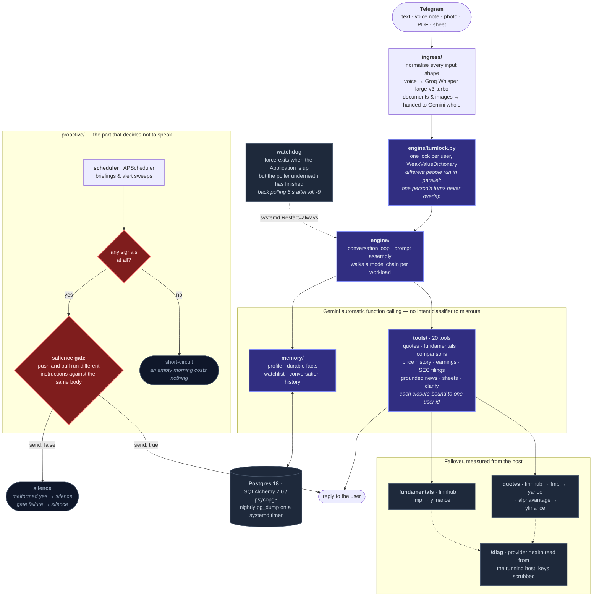

# Atlas

An AI financial analyst that lives in Telegram.

**Try it:** [@AtlasAnalyst_bot](https://t.me/AtlasAnalyst_bot), just say hello. There is nothing to configure and no command to learn.

---

## What it does

Atlas holds a conversation. It learns who you are as you talk, pulls live market data, reads the documents you send it, and speaks up on its own when something on your watchlist actually matters.

- **Conversation only.** No slash commands, no inline buttons, no menus. Onboarding happens by talking.
- **Live market data** — quotes, fundamentals, price history, earnings dates, SEC filings, and grounded news.
- **Documents that keep their shape** — send a PDF, a spreadsheet, a Google Sheet link, or a photo of a chart.
- **Voice** — send a voice note instead of typing.
- **Memory that persists** — role, timezone, watchlist, and durable facts, across restarts.
- **Proactive briefings and alerts**, including the decision *not* to send one.

## Five decisions worth reading the code for

### 1. Documents are handed to the model whole

Most PDF pipelines run `pypdf`, get a wall of text, and lose the tables, which in a financial filing is where the answer usually lives. A segment margin table flattens into an unlabelled column of numbers, and the model then confidently misreads it.

Atlas uploads the file to Gemini directly ([`atlas/integrations/gemini.py`](atlas/integrations/gemini.py)) and lets native document understanding read the layout. Tables stay tables. Ask "which segment carried the quarter?" of a results PDF and it reads the margin column correctly rather than guessing from prose.

The same path handles images, so a photographed chart works too.

### 2. Silence is enforced control flow, not a prompt suggestion

The brief asks the assistant to stay quiet when nothing is important. Saying "only message when it matters" in a system prompt does not survive contact with a model that wants to be helpful.

So the salience gate ([`atlas/proactive/salience.py`](atlas/proactive/salience.py)) is real code:

- No signals at all short-circuits **before** any model call; an empty morning costs nothing.
- The gate returns `send: true/false`, and `false` sends nothing.
- A malformed yes with an empty body is still silence.
- A gate failure defaults to silence. A briefing nobody asked for is worse than one that never arrives.

Push and pull run **different instructions against the same body**. An unprompted 7 a.m. ping must clear a high bar; "what's happening with my names?" must not; silence is the wrong answer to someone who just asked. That distinction is tested, not assumed.

### 3. Market data fails over, and the failover is measured from the host

`yfinance` works perfectly from a laptop and is silently rate-limited from a datacenter IP. You cannot discover that locally; the deploy target is the only place the question has an answer.

Atlas chains five quote providers and three fundamentals providers ([`atlas/integrations/marketdata.py`](atlas/integrations/marketdata.py)), and exposes `/diag` so provider health can be read **from the running host**:

```
/diag  →  quotes:       finnhub ✓  fmp ✓  yahoo ✓  alphavantage ✓  yfinance ✓
          fundamentals: finnhub ✓  fmp ✓  yfinance ✓
```

That endpoint is why the deployed bot answers instead of apologising. Provider
errors are scrubbed of API keys before they are shown; `/diag` is public, and an
unscrubbed error hands out credentials.

It also catches the failure mode that looks like a working system. Two providers
once sat dead in the chain for weeks: one key was never set, and FMP answered
`403` on every call because it had retired `/api/v3` and served only a *"Legacy
Endpoint"* message to keys issued after August 2025. A 403 reads exactly like a
rejected key, so the key got blamed. The endpoint was the problem. Nothing broke
visibly, because the provider *below* them in the chain answered, which is the
whole point of a chain, and precisely why it needs a health endpoint to see
inside it.

### 4. Rate limits are routed around, not waited out

Gemini's free tier meters **per model**: 5 requests/minute for each. So a 429 on one model is not a global stop, falling back to a *different* model draws from a fresh bucket.

Atlas walks a model chain per workload ([`atlas/integrations/gemini.py`](atlas/integrations/gemini.py)) and caps total wait so a user never watches a spinner for a minute.

Quota is not the only thing worth surviving. Transient upstream faults (`499
CANCELLED`, `503 UNAVAILABLE`) also carry to the next model, because they say
nothing about the request itself. That distinction was learned the hard way: a
`499` on the first call of a freshly deployed process aborted the whole turn with
two untried models still in the chain, and the user got an apology instead of a
quote. Genuine faults still stop at the first model, since retrying a malformed
request three times only makes someone wait three times as long to be told no.

### 5. Concurrency is per-user ordered, not free-for-all

Updates used to be processed strictly one at a time, so one slow turn (a PDF
upload, a voice note) stalled every other user behind it.

Running them concurrently removes that, but it also removes the accidental
protection serial processing gave: `respond()` reads the conversation history,
*then* appends to it, with a multi-second model call in between. Two overlapping
turns from one person would each answer a prompt the other had already
invalidated, then interleave their rows in the log. Because history is ordered by
row id, a tangled pair stays tangled for the next twenty turns.

So [`atlas/engine/turnlock.py`](atlas/engine/turnlock.py) holds one lock per user
in a `WeakValueDictionary`; different people run in parallel, one person's turns
never overlap, and the registry cannot grow without bound because a lock exists
only while someone holds or waits on it. What that buys is mutual exclusion, not
arrival ordering; the docstring says so plainly rather than promising a guarantee
the design does not make.

## Architecture

Agentic core, deterministic edges. Gemini's automatic function calling runs the loop; there is no intent classifier to misroute a question.



Read the red path first. Everything else is a conversation loop; the gate is the part that had to be code, because "only message when it matters" in a system prompt does not survive contact with a model that wants to be helpful.

**20 tools**, each bound to one user by closure; the model never supplies a user id, so it cannot reach another user's data.

`get_quote` · `get_fundamentals` · `compare_companies` · `market_overview` · `get_price_history` · `get_earnings_info` · `get_recent_filings` · `search_financial_news` · `analyze_sheet` · `clarify` · `remember` · `recall` · `forget_about` · `update_profile` · `add_to_watchlist` · `remove_from_watchlist` · `brief_me_now` · `create_alert` · `list_alerts` · `cancel_alert`

### Ambiguity is a tool call

"Tell me about Apple" is underspecified. Rather than picking one reading and writing three paragraphs the user did not want, the model calls `clarify` ([`atlas/tools/clarify.py`](atlas/tools/clarify.py)) and offers concrete options in plain prose; no buttons, because the brief forbids them.

## Stack

Python 3.13 · python-telegram-bot 22 · Gemini (chat, vision, documents, grounded search) · Groq Whisper `large-v3-turbo` · PostgreSQL 18 + SQLAlchemy 2.0 / psycopg3 · APScheduler · Finnhub · FMP · Yahoo · Alpha Vantage · SEC EDGAR · Azure VM under systemd

## Tests

```bash
pip install -e ".[dev]"
pytest          # 191 tests
```

Weighted toward the behaviour most likely to regress quietly: the silence path. A briefing that fires when it shouldn't is the failure a user actually notices, and it is invisible in a happy-path test.

The same bias explains the newer files. `tests/test_concurrency.py` pins the
per-user ordering above; a test that two turns interleave is worthless unless it
also proves two *different* users still overlap. `tests/test_main_wiring.py`
exists because `main()` had no coverage at all, which is exactly how a bot that
replayed a day-old backlog on every restart went unnoticed. And
`tests/test_env_docs.py` derives its expectations from `config.py` rather than a
hardcoded list, so a provider added later fails the suite instead of quietly
going undocumented.

## Running it

```bash
cp .env.example .env      # TELEGRAM_TOKEN, GEMINI_API_KEY, GROQ_API_KEY are required; market-data keys are optional
pip install -e .
python -m atlas.main
```

### Deployment

Runs on an Azure VM under `systemd`, with Postgres 18 on the same host and a
nightly `pg_dump` on a systemd timer.

The hosting choice is load-bearing rather than incidental. Atlas is a long-lived
polling process: it holds a `getUpdates` long poll and runs an in-process
scheduler for briefings and alerts. On a free tier that sleeps when idle, that
shape fails badly, polling is *outbound*, so a sleeping bot is never woken by a
Telegram message, only by unrelated HTTP traffic.

Worse, the failure is silent. The health server runs on its own thread, so when
polling dies the process keeps answering `200` while fetching nothing, and a
platform health check sees a service in perfect health. Atlas answered nobody
for days that way.

Two things fix it. `atlas/main.py` runs a watchdog that force-exits when the
Application is up but the poller underneath it has finished, and `/` returns
`503` once polling has stopped instead of a cheerful `200`. `systemd` then does
what a health check could not:

```ini
Restart=always
RestartSec=5
StartLimitIntervalSec=0    # in [Unit] — systemd ignores it under [Service]
```

Verified by `kill -9`: back and polling in six seconds.

[`render.yaml`](render.yaml) is kept for one-command Blueprint deploys. If you
use it, set `PUBLIC_URL` so the self-ping keeps the service awake, and keep the
database in the web service's region; Render's internal database hostname is
region-scoped and will not resolve across regions.
